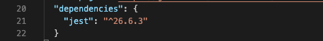

# Choosing your framework

Now it's time to install jest, jest is a 3rd party library (piece of code) ideal for front-end and backend unit test development.
Like most of the libraries in the world of javascript or node.js we are going to be installing it thru NPM.

NPM is a marketplace for javascript/node libraries, almost all the libraries are free and open source and you can download them in just a couple of minutes.

## 📝 Installation

When using the NPM package manager, you can install any 3rd party package or library (like jest, react, angular, etc.) by running the following command:

```bash
$ npm install <your_package_name> --save
```

Note: you have to replace `<your_package_name>` with the name of your package, in our case:

```bash
$ npm install jest --save
```

Note: if you don't include `--save` it will not be installed properly.

## ✅ Check for success

If your package was installed successfully you will find that:

- There is a new folder in your root called `./node_modules` 
- If you open your package.json file, you will find `jest` inside the `dependencies` object like this:


