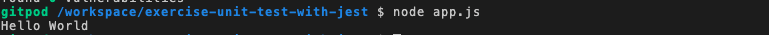

# `03` Entry Point

Ok, we have successfully installed Jest! And we are going to use it soon...

But first, we  have to create a file that will represent the entry point of our application.

## 📝 Instructions:

1. Create an `app.js` file on the root of your project that contains the following content:

```js
// app.js file content
console.log("Hello World")
```

## 💻 Expected result:

To verify that the result has been successful, run the following command on your console:

```bash
$ node app.js
```

## 💡 Hint:

+ It should print "Hello World" in the console like this:


