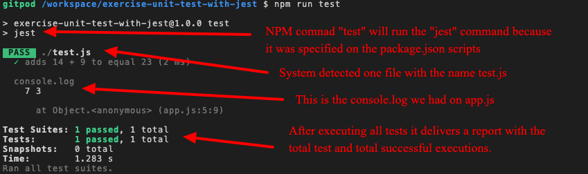

# `07.1` Analyzing the test

¿Qué acaba de suceder?

Básicamente, cuando se ejecuta el comando `npm run test`, la computadora usará la librería `jest` para escanear tus archivos en busca de aquellos que contengan la palabra `test`. En nuestro caso teníamos un archivo llamado `test.js`.

Después de que Jest descubre tus archivos de test, este comenzará a ejecutar las funciones `test()` dentro de esos archivos.

## Acerca de la salida:

Cada vez que realices `npm run test`, obtendrás un informe en la línea de comandos especificando cuántos archivos se encontraron que contenían la palabra "test" y cuántos de ellos se ejecutaron correctamente.

