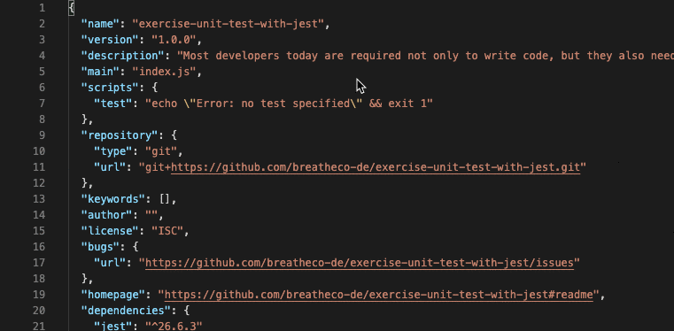
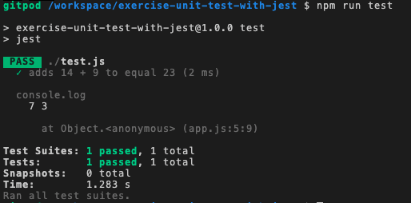

# `08` Ejecutando la prueba

Antes de ejecutar nuestra prueba, tenemos que actualizar tu archivo package.json para especificar el comando `test` con la palabra` jest` de la siguiente manera:

```json
{
  "scripts": {
    "test": "jest"
  }
}
```

Nota: Abre el package.json y busca los scripts de "test".



## 📝 Instrucciones

Escriba en la consola el siguiente comando:

```
$ npm run test
```

## ✅ Verificar el éxito del proceso

Si todo está bien, deberías obtener una salida de consola como esta:

