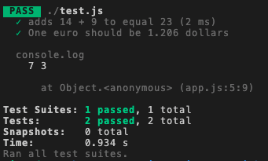

#   `12` Implementando la función

Ahora que la prueba está lista, tenemos que implementar la función que deberá satisfacer esa prueba.
La función debe ser implementada en app.js porque es parte de nuestra aplicación, no de nuestras pruebas.

Coloca el siguiente código al **comienzo** de tu app.js:

```js
// declaramos una funcion con el mismo nombre "formEuroToDollar"
const fromEuroToDollar = function(valueInEuro){
    // convertimos el valor a dolares
    let valueInDollar = valueInEuro * 1.2;
    // retornamos el valor
    return valueInDollar;
}
```

Asegúrate de actualizar el `module.exports` ubicado al final del archivo de esta forma:

```js
// tenemos que incluir la funcion en el exports para que sea exportada a otros archivos como test.js
module.exports = { sum, fromEuroToDollar }
```

## 📝 Instrucciones

Ejecuta las pruebas nuevamente escribiendo lo siguiente en el terminal:

```bash
$ npm run test

```

## ✅ Prueba de éxito
Después de ejecutar tu prueba deberías tener un reporte exitoso con dos pruebas exitosas como este:

